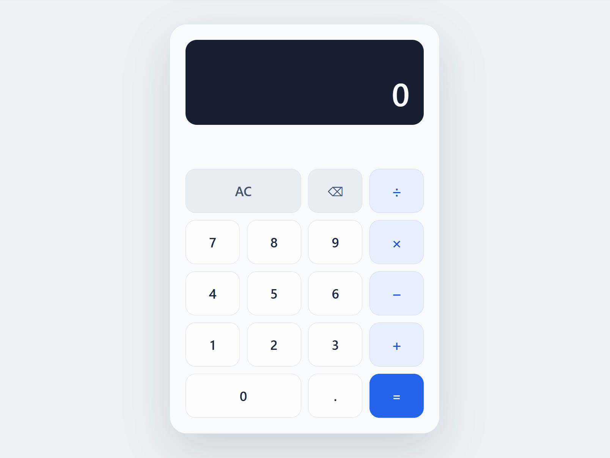

# Calculator Technical Assessment

A full-stack calculator application built as part of a technical assessment.

The application provides a REST API for basic arithmetic operations and a React frontend with a calculator-style interface. Arithmetic operations are performed by the backend, while the frontend manages the calculator state and user interaction.

## Project Preview
<center>

</center>

## Project Structure

```text
Calculator-Technical-Assessment/
├── backend/
│   ├── main.py
│   ├── test_main.py
│   └── requirements.txt
├── frontend/
│   ├── src/
│   │   ├── App.jsx
│   │   ├── App.css
│   │   └── App.test.jsx
│   ├── package.json
│   └── ...
├── README.md
└── .gitignore
```

## Requirements

Before running the project, make sure you have installed:

- Python 3
- pip
- Node.js
- npm

## Setup

Clone the repository:

```bash
git clone https://github.com/incarasa/Calculator-Technical-Assessment
cd Calculator-Technical-Assessment
```

### Backend Setup

Create a Python virtual environment.

**Windows**

```bash
python -m venv .venv
.\.venv\Scripts\activate
```

**macOS / Linux**

```bash
python3 -m venv .venv
source .venv/bin/activate
```

Install the backend dependencies:

```bash
pip install -r backend/requirements.txt
```

### Frontend Setup

Install the frontend dependencies:

```bash
cd frontend
npm install
```

## Running the Application

The frontend and backend run as separate development servers.

### Run the Backend

From the project root:

```bash
uvicorn backend.main:app --reload
```

The API will be available at:

```text
http://127.0.0.1:8000
```

A request to the root endpoint should return:

```json
{
  "message": "Calculator API is running"
}
```

### Run the Frontend

Open another terminal and navigate to the frontend directory:

```bash
cd frontend
npm run dev
```

Vite will display the local development URL, typically:

```text
http://localhost:5173
```

Open this URL in a browser to use the calculator.

## API Documentation

FastAPI automatically generates interactive OpenAPI documentation.

With the backend running, open:

```text
http://127.0.0.1:8000/docs
```

The Swagger UI can be used to inspect and manually test all available API endpoints.

## API Usage

All calculator operations use `GET` requests and receive the operands through the `a` and `b` query parameters.

### Addition

```http
GET /api/add?a=5&b=3
```

Response:

```json
{
  "result": 8
}
```

### Subtraction

```http
GET /api/subtract?a=5&b=3
```

Response:

```json
{
  "result": 2
}
```

### Multiplication

```http
GET /api/multiply?a=5&b=3
```

Response:

```json
{
  "result": 15
}
```

### Division

```http
GET /api/divide?a=10&b=2
```

Response:

```json
{
  "result": 5
}
```

Division by zero returns HTTP `400 Bad Request`:

```http
GET /api/divide?a=10&b=0
```

```json
{
  "detail": "Division by zero is not allowed"
}
```

Invalid numeric parameters are automatically validated by FastAPI and return HTTP `422`.

For example:

```http
GET /api/add?a=hello&b=3
```

## Testing

Both the backend and frontend include automated tests covering their main functionality.

### Backend Tests

Backend tests use `pytest` and FastAPI's `TestClient`.

From the project root:

```bash
python -m pytest backend/test_main.py -v
```

The backend test suite covers:

- Root endpoint
- Addition
- Subtraction
- Multiplication
- Division
- Division by zero
- Invalid numeric input

### Backend Coverage

Coverage is measured using `pytest-cov`.

```bash
python -m pytest backend/test_main.py --cov=main --cov-report=term-missing
```

Current result:

```text
Name             Stmts   Miss   Cover
------------------------------------
backend/main.py      21      0    100%
------------------------------------
TOTAL                21      0    100%
```

### Frontend Tests

Frontend tests use Vitest and React Testing Library.

From the `frontend` directory:

```bash
npm test
```

The current test suite contains six tests covering:

- Initial calculator state
- Numeric input
- Resetting the calculator with AC
- Sending an operation to the API and displaying its result
- Handling an error response from the backend
- Handling a backend connection failure

API requests are mocked in the frontend unit tests so that the frontend can be tested independently from the FastAPI server.

### Frontend Coverage

From the `frontend` directory:

```bash
npm run coverage
```

Current coverage for `App.jsx`:

```text
Statements : 73.33%
Branches   : 56.41%
Functions  : 77.77%
Lines      : 78.78%
```

Coverage is used as an aid for identifying untested code paths rather than as a target by itself. The tests prioritize the main user-visible behaviors and API integration paths.

## Design Decisions

### FastAPI Backend

FastAPI was selected because it provides a concise way to build typed REST APIs in Python, including automatic request validation and OpenAPI documentation.


### React with JavaScript

The frontend uses React with JavaScript.

JavaScript was selected to keep the implementation within familiar technology and prioritize a solution that could be implemented, tested, and maintained confidently within the available time.

### Stateless API

The backend does not store calculator state or previous results.

Each API request contains both operands required to perform the operation. Calculator state, including the current display, selected operator, and operands, is managed by React.

This keeps the backend stateless and separates API responsibilities from user interface state.

### Separate Operation Endpoints

Each arithmetic operation has its own endpoint:

```text
/api/add
/api/subtract
/api/multiply
/api/divide
```

This keeps the API explicit and easy to understand for the small number of supported operations.

### Query Parameters

Operands are sent as query parameters because the operations are simple, read-only calculations and do not modify server-side resources.

FastAPI type annotations validate the operands as numeric values.

### Calculator-Style Interface

Instead of using two independent numeric inputs, the frontend uses a familiar calculator-style interface.

React manages the input sequence and calculator state, but arithmetic operations themselves are sent to the backend when the user presses `=`.

This keeps the API integration visible in the application architecture rather than duplicating the arithmetic logic in the frontend.

### API Requests

The frontend uses the browser's native `fetch` API.

Requests are triggered directly by the user's interaction with the calculator, so no `useEffect` is required for API calls.

The frontend handles successful responses, HTTP errors returned by the API, and network errors such as the backend being unavailable.

### CORS

During development, the React application and FastAPI API run on different origins.

FastAPI's CORS middleware allows `GET` requests from the local Vite development server so that the browser can communicate with the backend.

## AI Tooling

AI-assisted development tools were used during this assignment as permitted by the assessment instructions.

AI was primarily used to:

- Discuss implementation alternatives and keep the project scope appropriate for the assignment.
- Generate initial implementations for parts of the backend and frontend.
- Assist with test setup using pytest, Vitest, and React Testing Library.
- Explain unfamiliar concepts and review implementation decisions.
- Assist with documentation.

Generated code was reviewed, executed, tested, and adjusted before being included in the project.